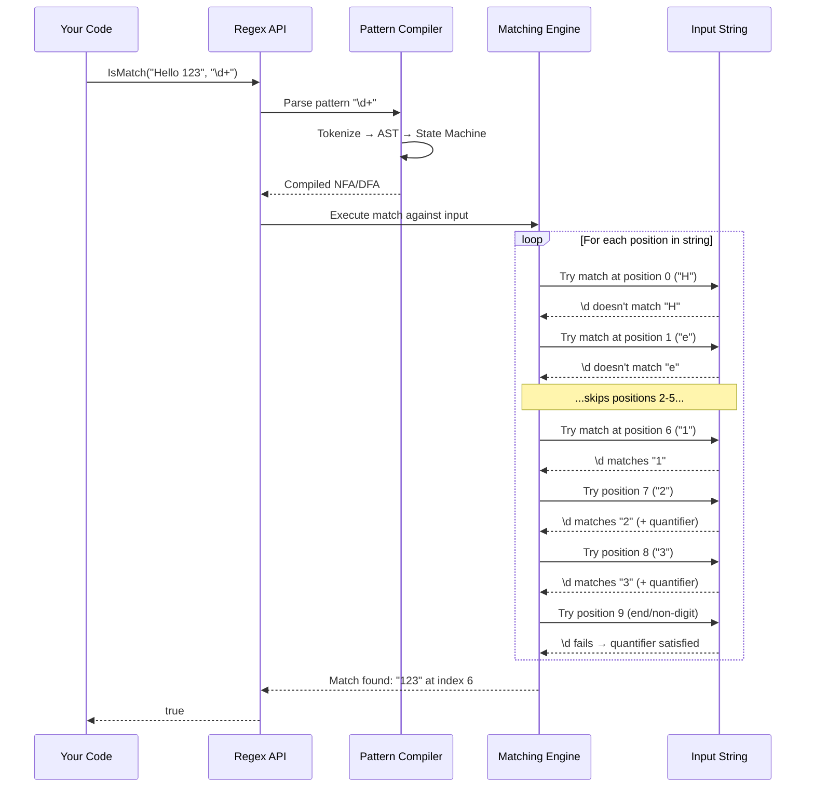
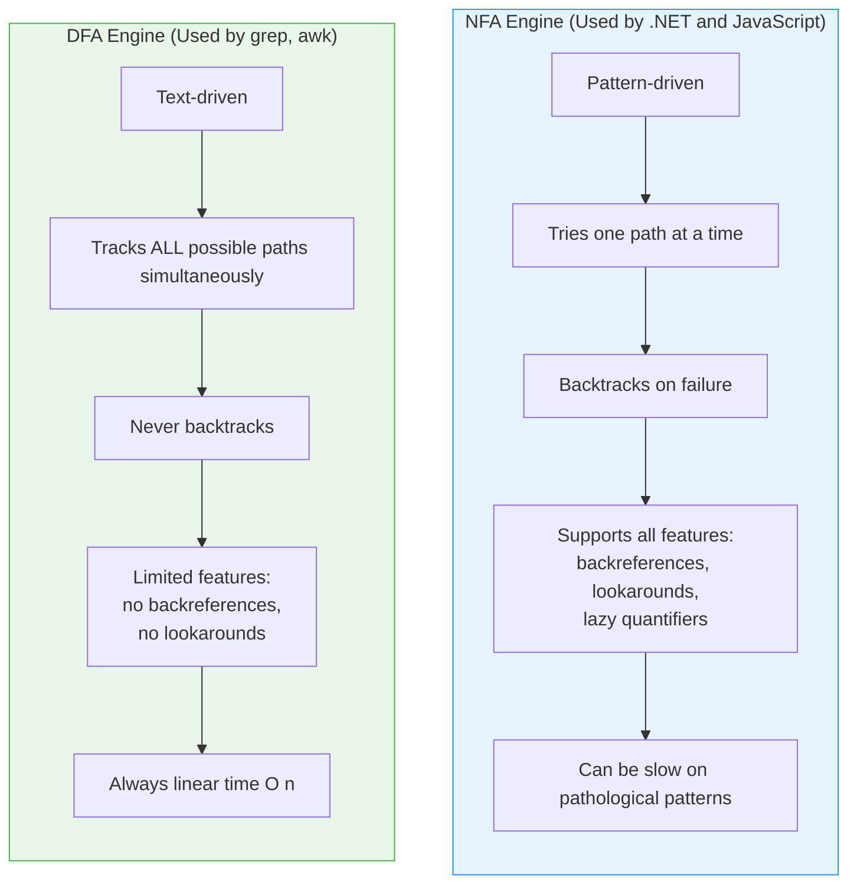
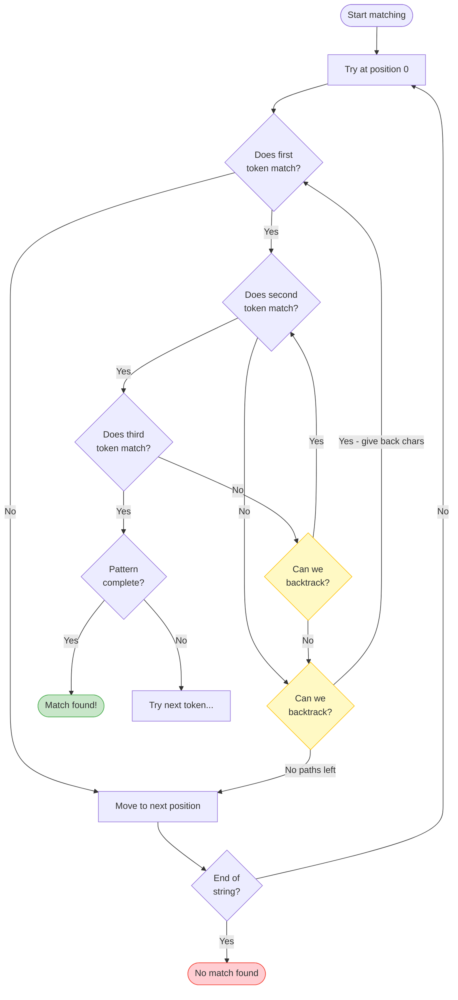
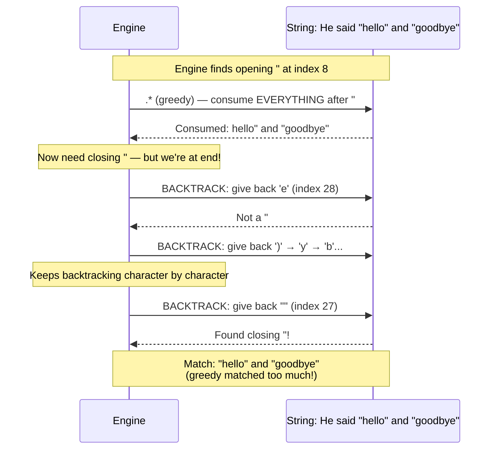
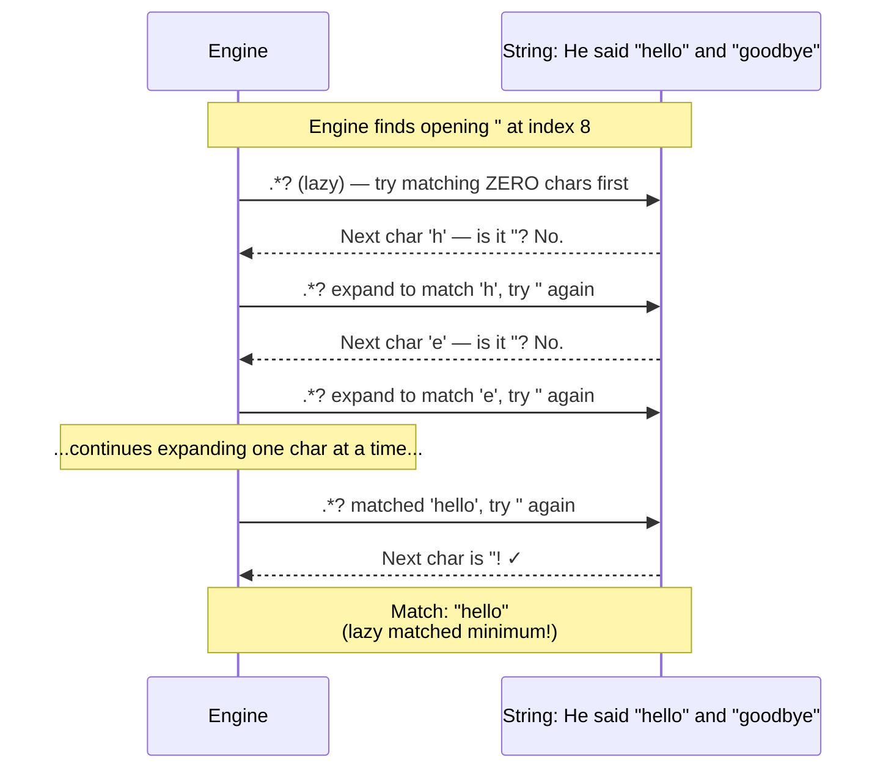
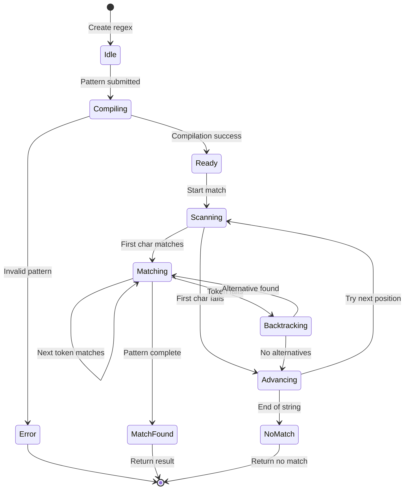
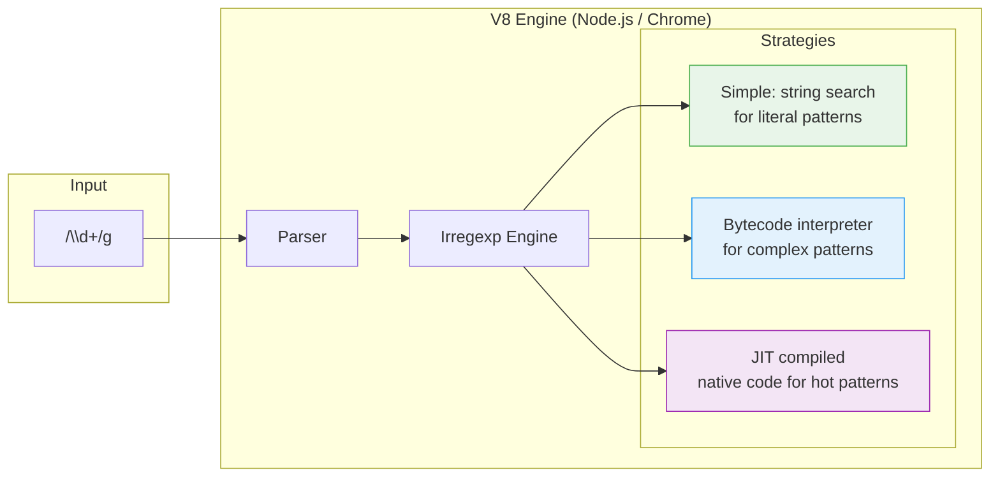

# Regex Engine Internals

Understanding how the regex engine works under the hood helps you write efficient, correct patterns.

---

## How a Regex Engine Processes a Match

When you call `Regex.IsMatch()` or `/pattern/.test()`, the engine follows this lifecycle:



---

## NFA vs DFA — Two Types of Regex Engines



---

## The Backtracking Process

This is the most important concept for understanding regex performance:



---

## Backtracking Example: Greedy `.*` in `".*"`

Matching `".*"` against `He said "hello" and "goodbye"`:



### The Lazy Version: `".*?"`



---

## Match Lifecycle — State Diagram



---

## .NET Regex Compilation Pipeline

```mermaid
flowchart LR
    subgraph Input
        P[Pattern String<br/>"\\d{3}-\\d{4}"]
    end

    subgraph Compilation
        direction TB
        Lex[Lexer/Tokenizer]
        Parse[Parser → AST]
        Opt[Optimizer]
        Gen[Code Generator]
        Lex --> Parse --> Opt --> Gen
    end

    subgraph Execution Modes
        direction TB
        Interp[Interpreted<br/>Default mode<br/>Fast startup]
        Compiled[RegexOptions.Compiled<br/>Emits IL code<br/>Fast execution]
        SrcGen["[GeneratedRegex]<br/>Compile-time C#<br/>Zero runtime cost"]
        NonBT[NonBacktracking<br/>.NET 7+<br/>Linear time O n]
    end

    P --> Compilation
    Gen --> Interp
    Gen --> Compiled
    Gen --> SrcGen
    Gen --> NonBT

    style Interp fill:#e3f2fd,stroke:#2196F3
    style Compiled fill:#e8f5e9,stroke:#4CAF50
    style SrcGen fill:#f3e5f5,stroke:#9C27B0
    style NonBT fill:#fff3e0,stroke:#FF9800
```

---

## JavaScript Regex Engine Flow


