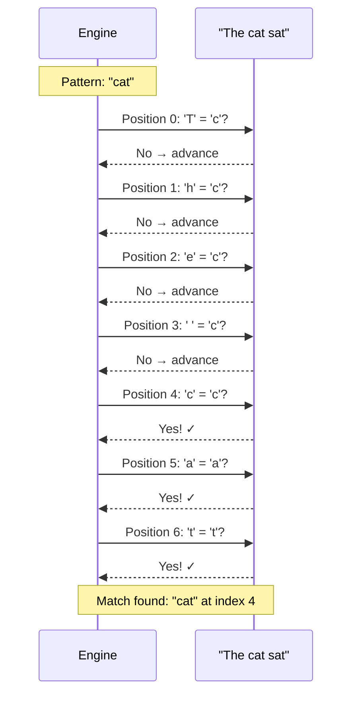
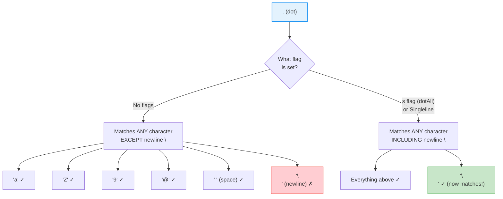
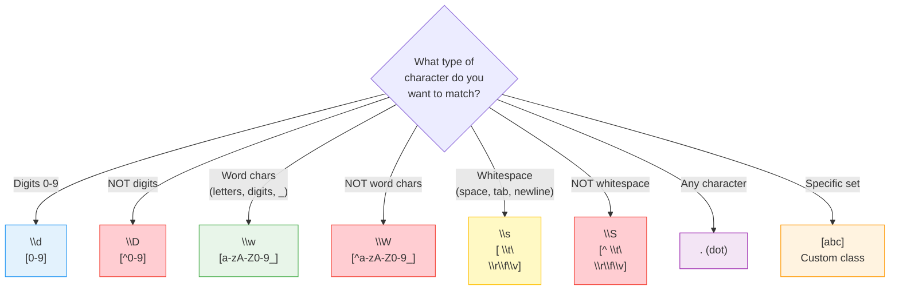
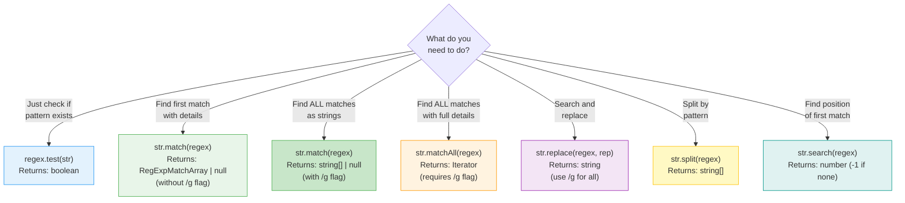
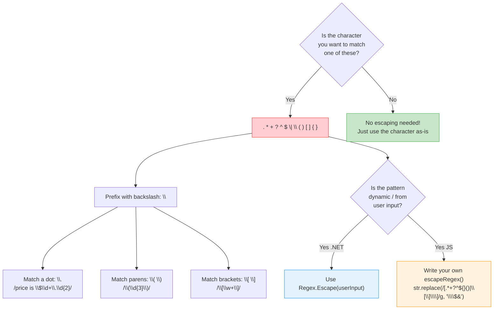
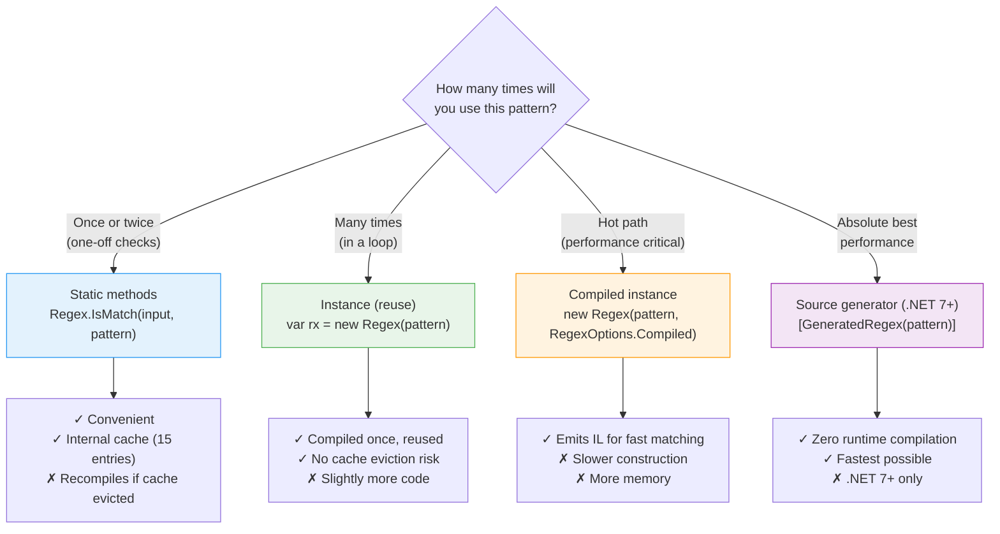
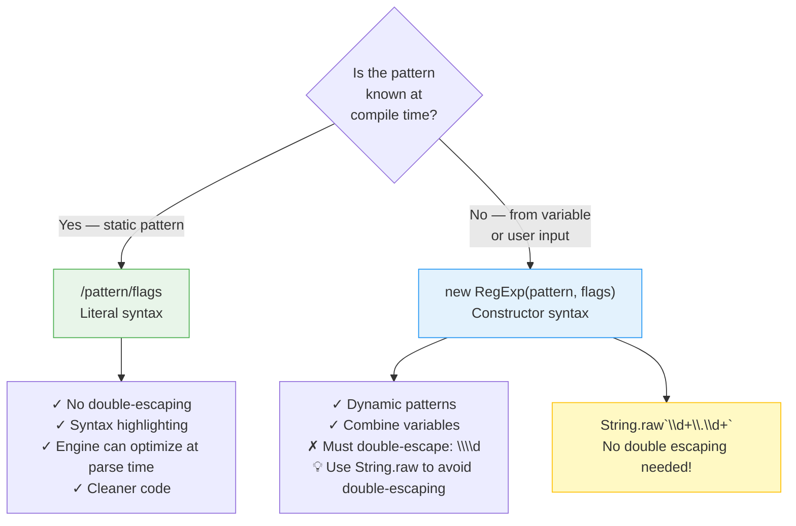

# Level 1 & 2: Beginner Concepts — Visual Diagrams

---

## How Literal Matching Works



---

## The Dot (.) Metacharacter — What It Matches



---

## Shorthand Character Classes — Decision Tree



---

## Which Method to Use — .NET

```mermaid
flowchart TD
    Start{What do you<br/>need to do?}

    Start -->|"Just check if<br/>pattern exists"| IsMatch["Regex.IsMatch()<br/>Returns: bool"]
    Start -->|"Find the FIRST<br/>match"| Match["Regex.Match()<br/>Returns: Match"]
    Start -->|"Find ALL<br/>matches"| Matches["Regex.Matches()<br/>Returns: MatchCollection"]
    Start -->|"Search and<br/>replace"| Replace["Regex.Replace()<br/>Returns: string"]
    Start -->|"Split string<br/>by pattern"| Split["Regex.Split()<br/>Returns: string[]"]

    IsMatch --> IsMatchEx["if (Regex.IsMatch(input, @\"\\d+\"))<br/>    // contains digits"]
    Match --> MatchEx["var m = Regex.Match(input, @\"\\d+\");<br/>m.Value, m.Index, m.Groups"]
    Matches --> MatchesEx["var ms = Regex.Matches(input, @\"\\d+\");<br/>foreach (Match m in ms) { ... }"]
    Replace --> ReplaceEx["Regex.Replace(input, @\"\\d+\", \"#\")<br/>// replaces ALL by default"]
    Split --> SplitEx["Regex.Split(input, @\",\\s*\")<br/>// split on comma+space"]

    style IsMatch fill:#e3f2fd,stroke:#2196F3
    style Match fill:#e8f5e9,stroke:#4CAF50
    style Matches fill:#fff3e0,stroke:#FF9800
    style Replace fill:#f3e5f5,stroke:#9C27B0
    style Split fill:#fff9c4,stroke:#FFC107
```

---

## Which Method to Use — TypeScript/JavaScript



---

## Escaping Special Characters — When to Escape



---

## Static vs Instance Regex (.NET)



---

## Regex Literal vs Constructor (TypeScript)


