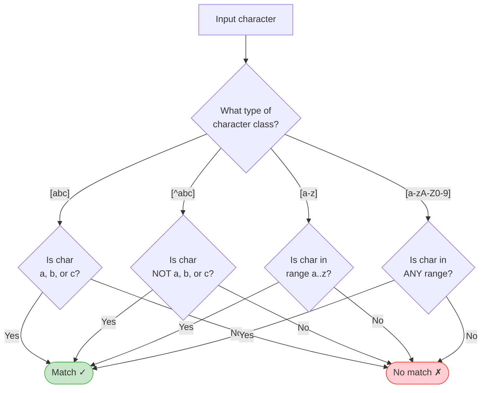
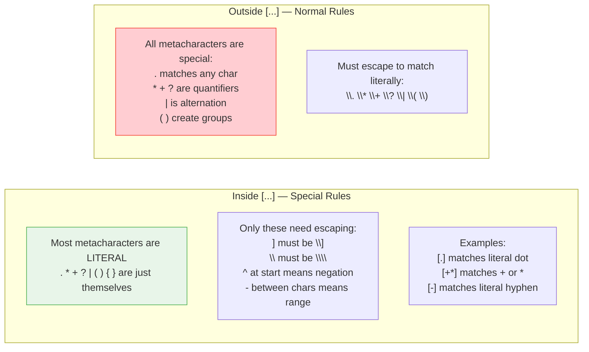
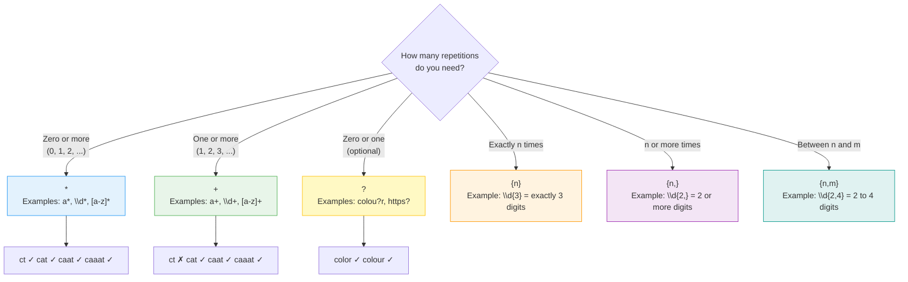
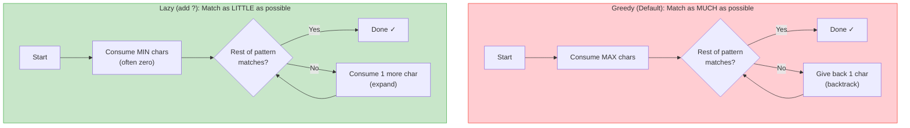
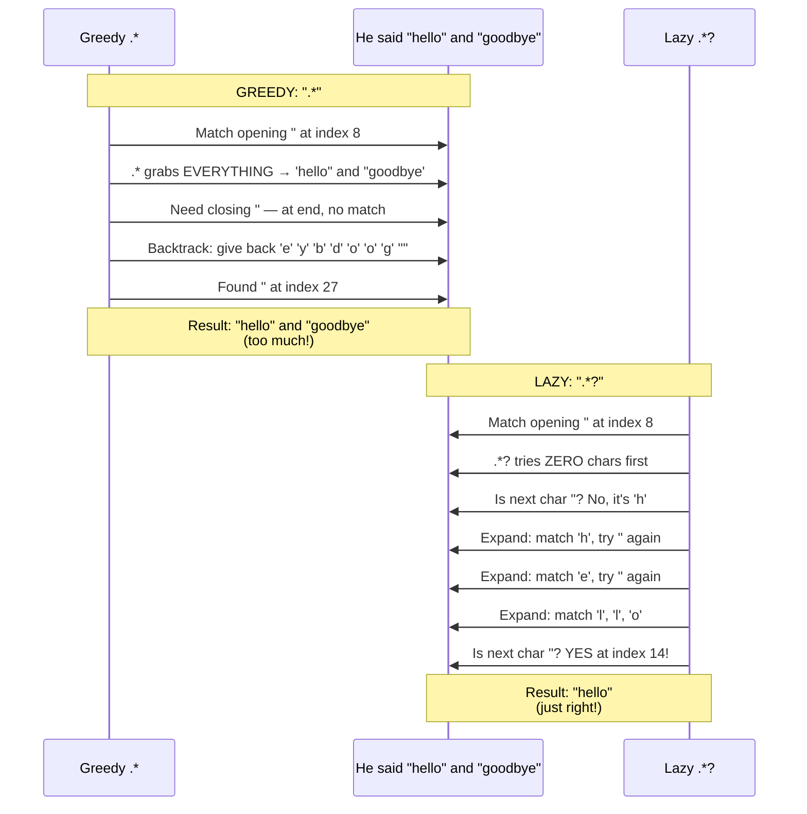
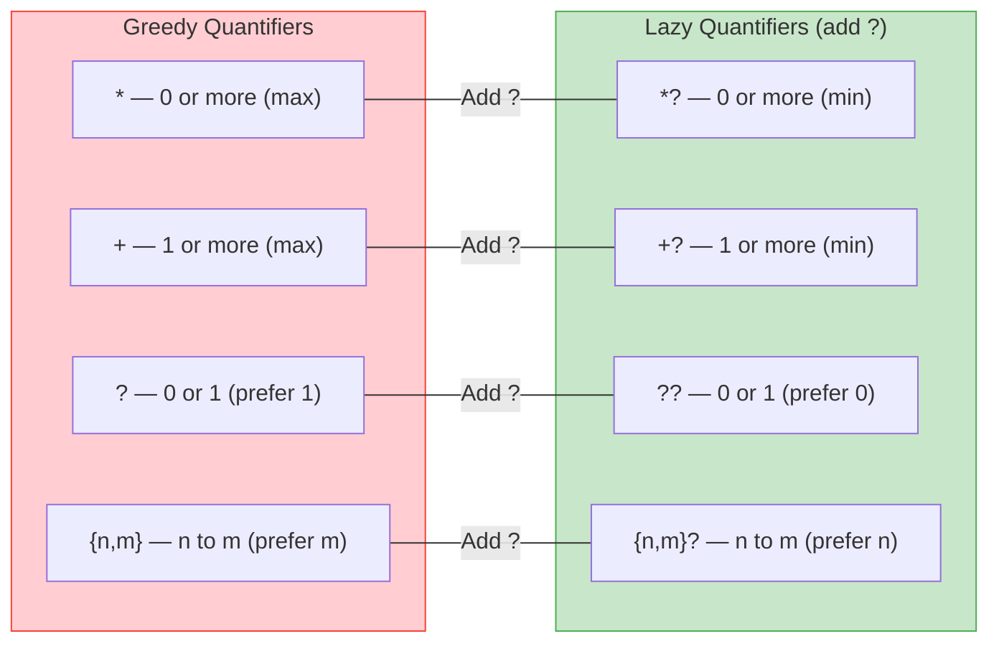
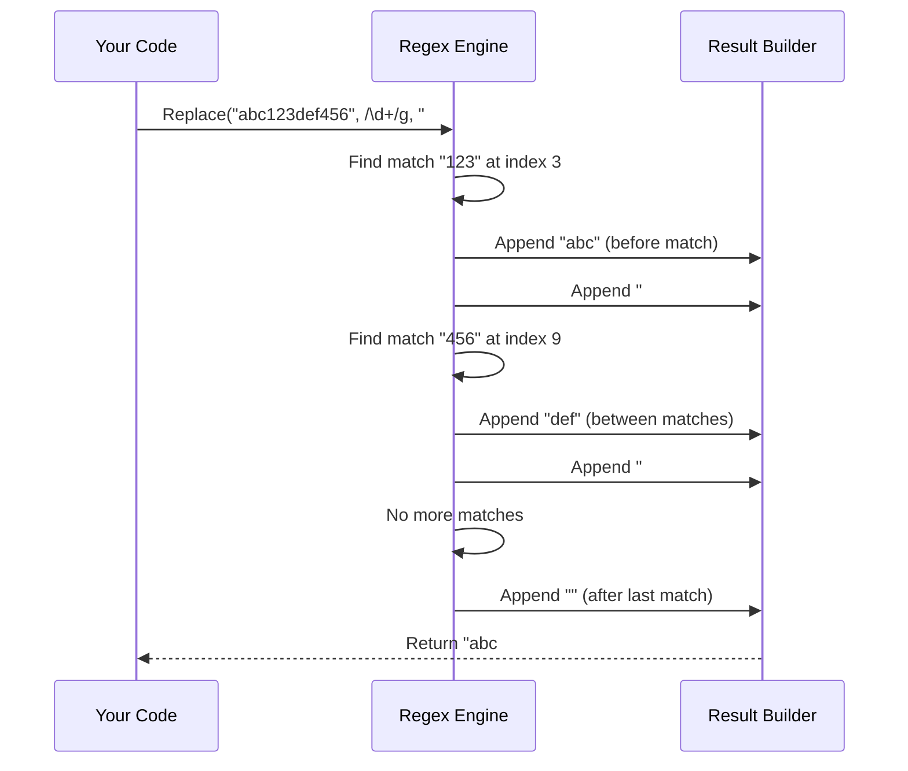
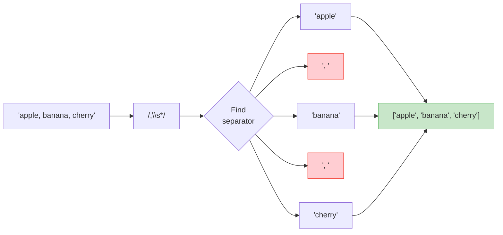

# Level 2: Character Classes & Quantifiers — Visual Diagrams

---

## Character Class Matching Flow

---

## Character Class — Inside the Brackets

---

## Quantifier Overview — How Many Times to Match

---

## Greedy vs Lazy — The Core Difference

---

## Greedy vs Lazy — Step by Step Example

Pattern `".*"` vs `".*?"` against: `He said "hello" and "goodbye"`

---

## Greedy vs Lazy — Quantifier Comparison Table

---

## Replace Flow — How Regex Replace Works

---

## Split Flow — How Regex Split Works

