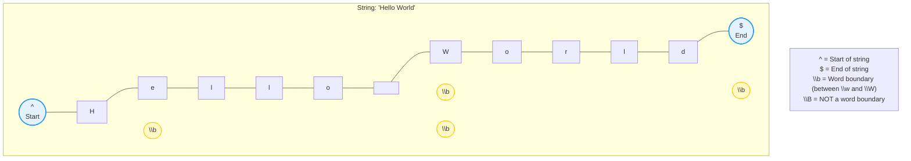
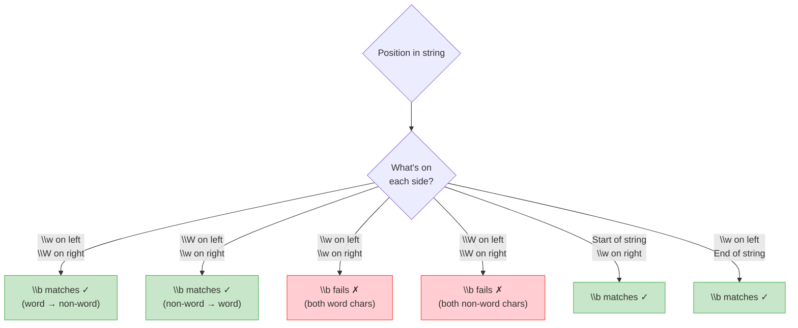
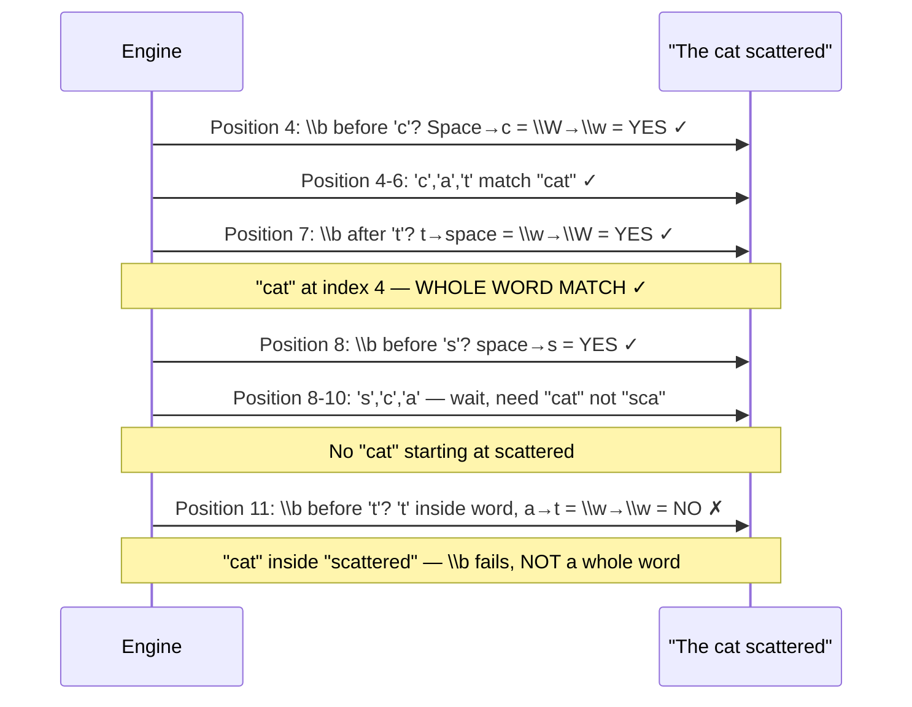
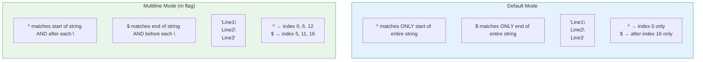
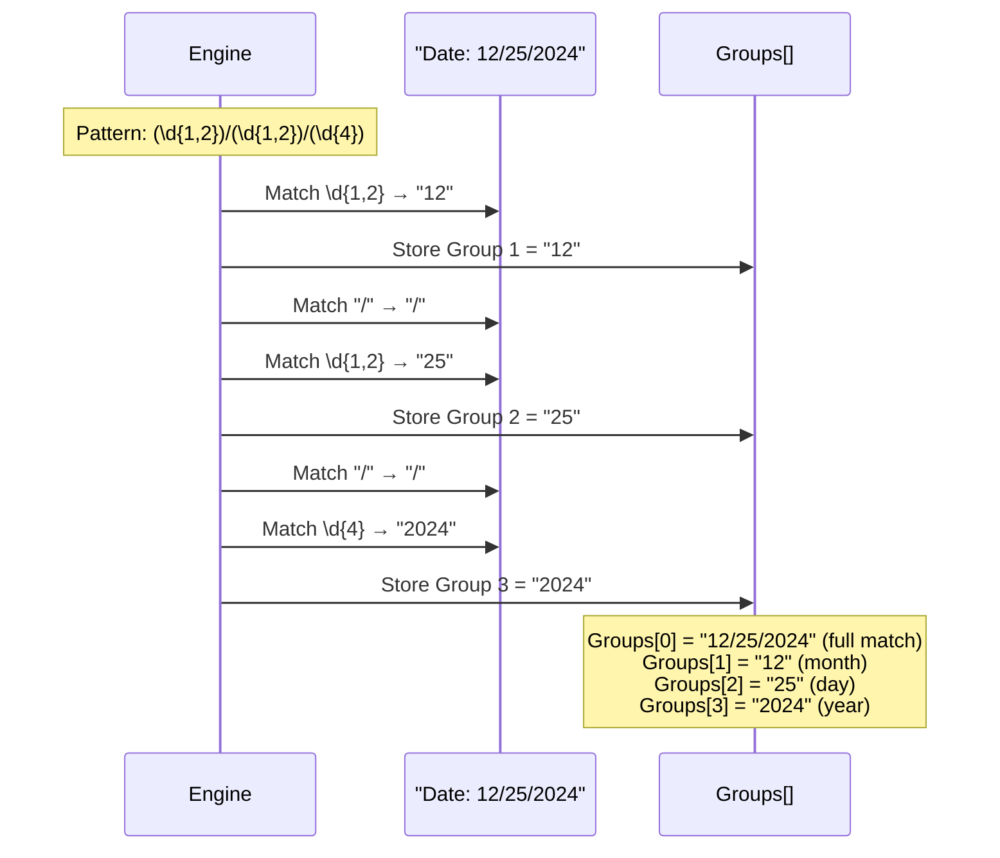
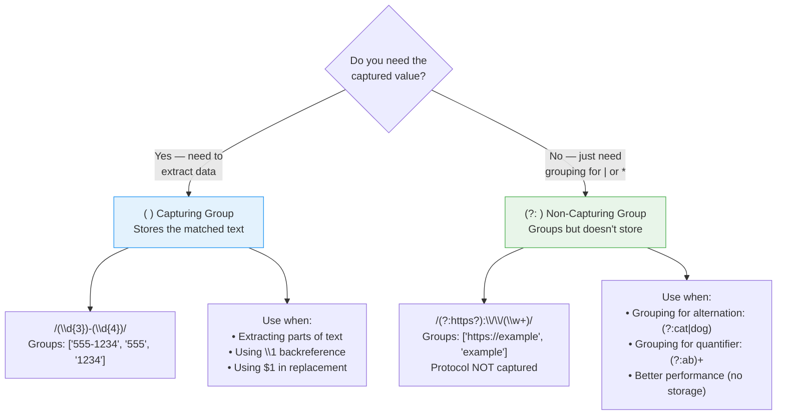
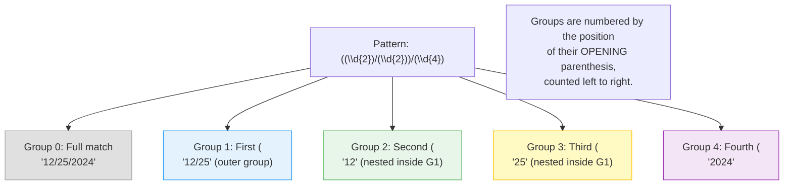
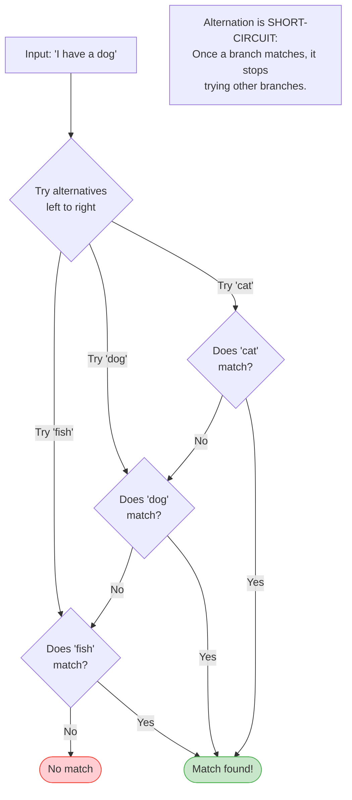
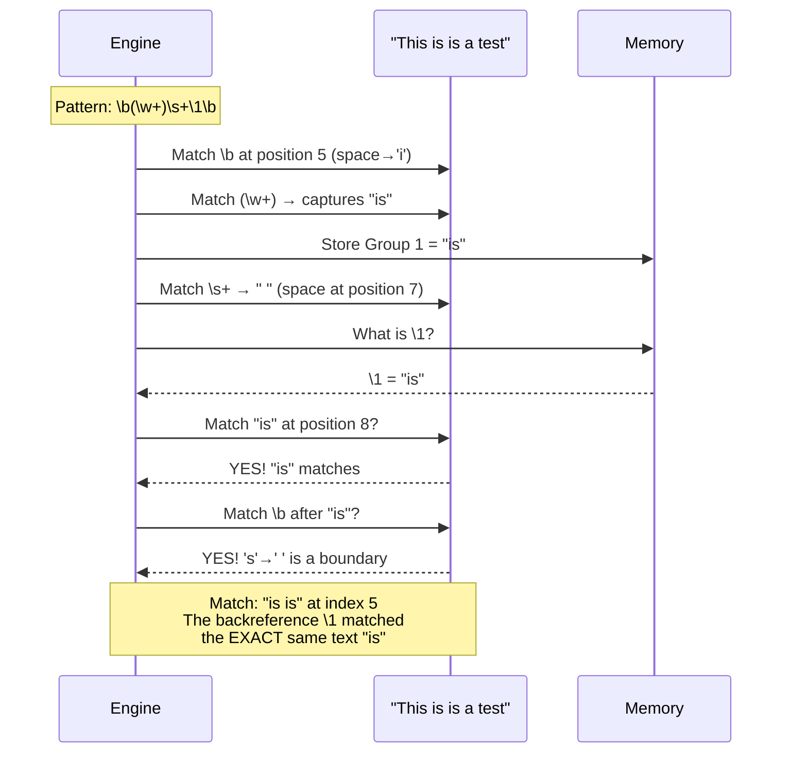
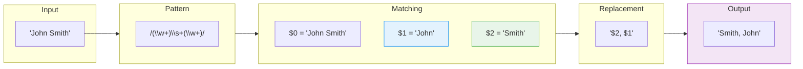

# Level 3: Groups, Anchors & Alternation — Visual Diagrams

---

## Anchors — Matching Positions, Not Characters

---

## Word Boundary (\\b) — Decision Flow

### Example: `\bcat\b` against "The cat scattered"

---

## Multiline Mode — How ^ and $ Change

---

## Capturing Groups — How They Work

---

## Capturing vs Non-Capturing Groups

---

## Group Numbering — Which Group is Which?

---

## Alternation — How the | Operator Works

---

## Backreference — Matching the Same Text Again

---

## Replace with Groups — $1, $2 Flow

