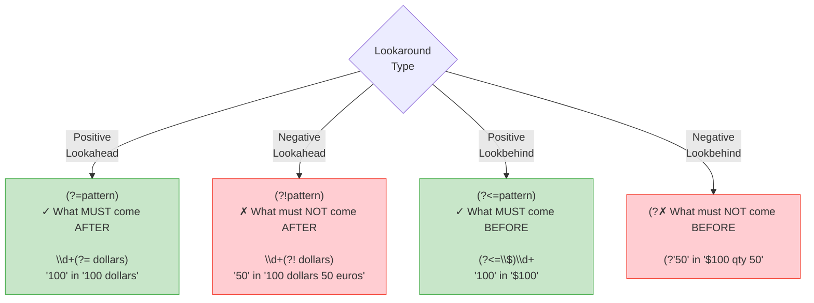
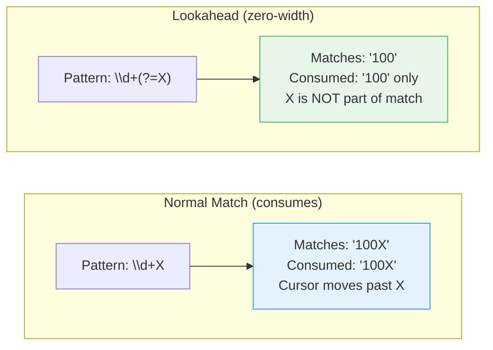
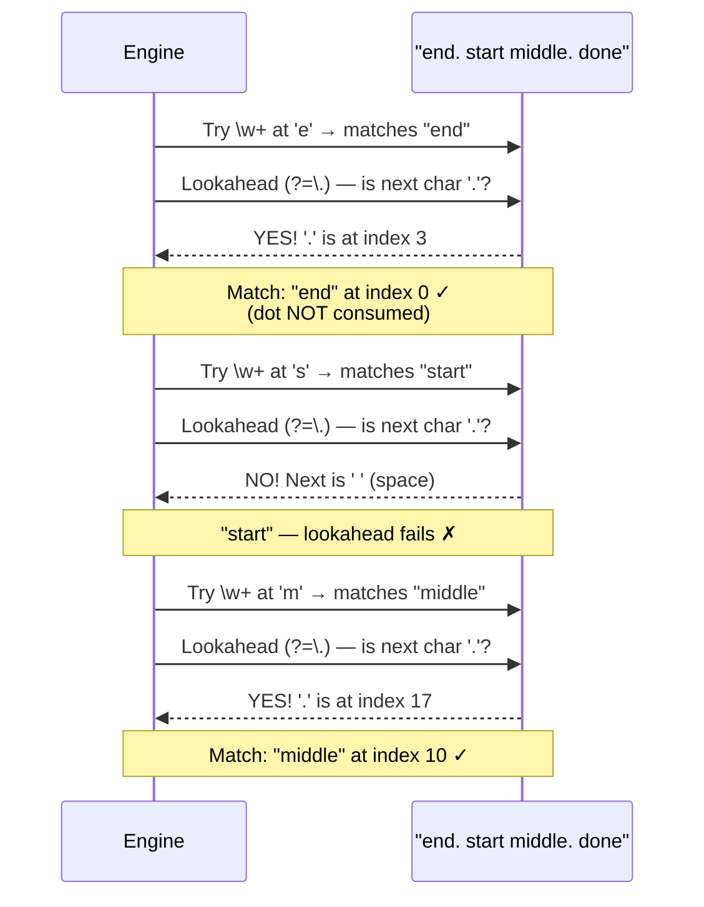
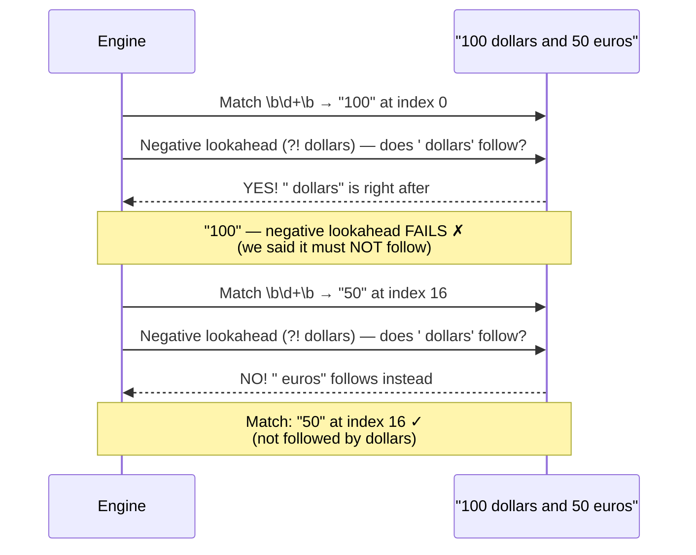
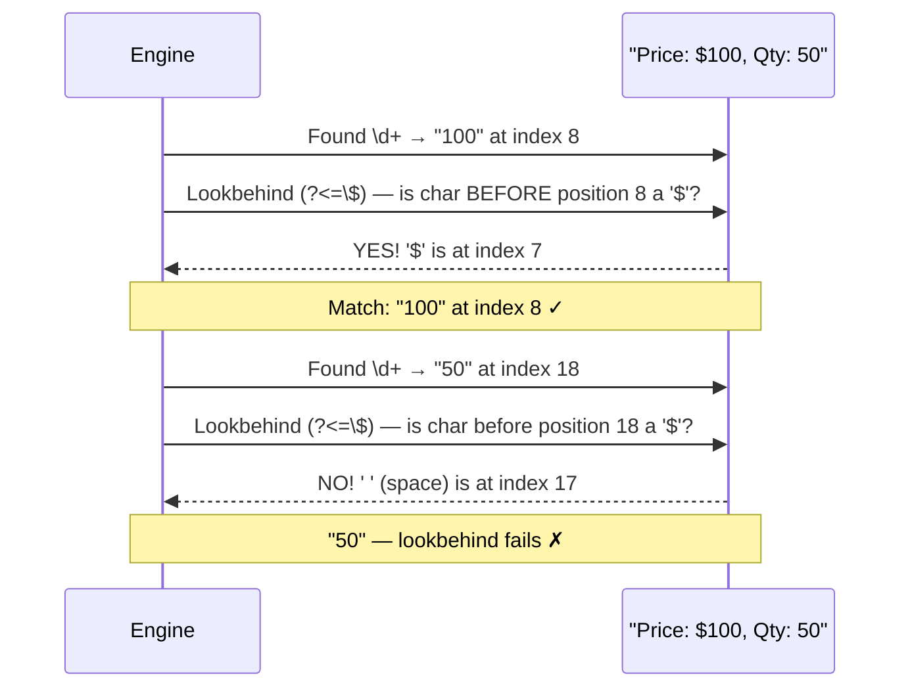
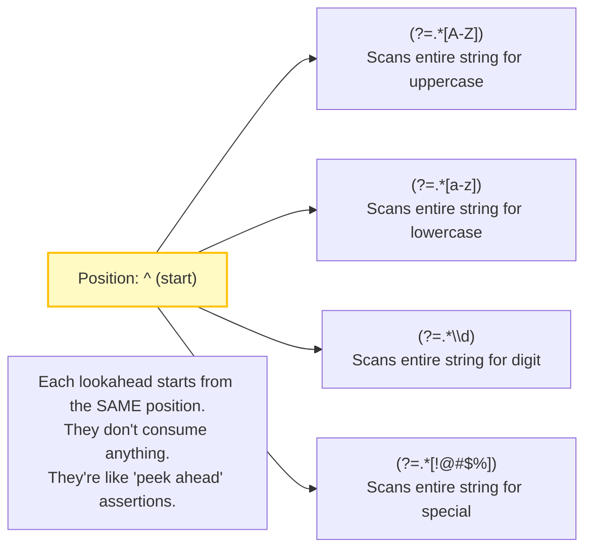
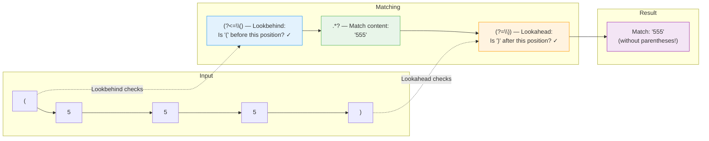
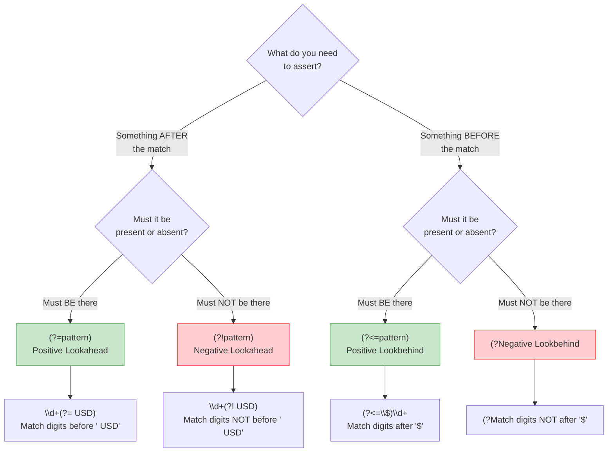

# Level 4: Lookahead & Lookbehind — Visual Diagrams

---

## The Four Lookaround Types — Overview



---

## Key Insight: Lookarounds Don't Consume Characters



---

## Positive Lookahead — Step by Step

Pattern: `\w+(?=\.)` against "end. start middle. done"



---

## Negative Lookahead — Step by Step

Pattern: `\b\d+\b(?! dollars)` against "100 dollars and 50 euros"



---

## Positive Lookbehind — Step by Step

Pattern: `(?<=\$)\d+` against "Price: $100, Qty: 50"



---

## Password Validation — Multiple Lookaheads Working Together

Pattern: `^(?=.*[A-Z])(?=.*[a-z])(?=.*\d)(?=.*[!@#$%]).{8,}$`

```mermaid
flowchart TD
    Input["Input: 'P@ssw0rd!'"] --> Start["^ (start of string)"]

    Start --> LA1{Lookahead 1:<br/>(?=.*[A-Z])<br/>Contains uppercase?}
    LA1 -->|"✓ Found 'P'"| LA2{Lookahead 2:<br/>(?=.*[a-z])<br/>Contains lowercase?}
    LA1 -->|"✗ No uppercase"| Fail([FAIL])

    LA2 -->|"✓ Found 's'"| LA3{Lookahead 3:<br/>(?=.*\d)<br/>Contains digit?}
    LA2 -->|"✗ No lowercase"| Fail

    LA3 -->|"✓ Found '0'"| LA4{Lookahead 4:<br/>(?=.*[!@#$%])<br/>Contains special?}
    LA3 -->|"✗ No digit"| Fail

    LA4 -->|"✓ Found '@'"| Len{.{8,}$<br/>At least 8 chars?}
    LA4 -->|"✗ No special char"| Fail

    Len -->|"✓ Length = 9"| Pass([PASS ✓])
    Len -->|"✗ Too short"| Fail

    style Pass fill:#c8e6c9,stroke:#4CAF50
    style Fail fill:#ffcdd2,stroke:#f44336
    style LA1 fill:#e3f2fd,stroke:#2196F3
    style LA2 fill:#e3f2fd,stroke:#2196F3
    style LA3 fill:#e3f2fd,stroke:#2196F3
    style LA4 fill:#e3f2fd,stroke:#2196F3
```

### Key Insight: All Lookaheads Check from the SAME Position



---

## Combined Lookarounds — Extract Between Delimiters

Pattern: `(?<=\().*?(?=\))` extracts text inside parentheses without including them.



---

## Number Formatting with Lookarounds

Pattern: `(?<=\d)(?=(\d{3})+\b)` inserts commas in numbers.

```mermaid
flowchart TD
    subgraph "Input: 1234567890"
        direction LR
        D1["1"] --- D2["2"] --- D3["3"] --- D4["4"] --- D5["5"] --- D6["6"] --- D7["7"] --- D8["8"] --- D9["9"] --- D0["0"]
    end

    subgraph "Positions where commas are inserted"
        direction TB
        P1["After '1': (?<=\\d)✓ (?=(\\d{3})+\\b) = 234567890 = 3×3 digits ✓ → INSERT ,"]
        P2["After '4': (?<=\\d)✓ (?=(\\d{3})+\\b) = 567890 = 2×3 digits ✓ → INSERT ,"]
        P3["After '7': (?<=\\d)✓ (?=(\\d{3})+\\b) = 890 = 1×3 digits ✓ → INSERT ,"]
    end

    subgraph Result
        R["1,234,567,890"]
    end

    style P1 fill:#c8e6c9,stroke:#4CAF50
    style P2 fill:#c8e6c9,stroke:#4CAF50
    style P3 fill:#c8e6c9,stroke:#4CAF50
    style R fill:#f3e5f5,stroke:#9C27B0
```



---

## Lookaround Decision Guide


