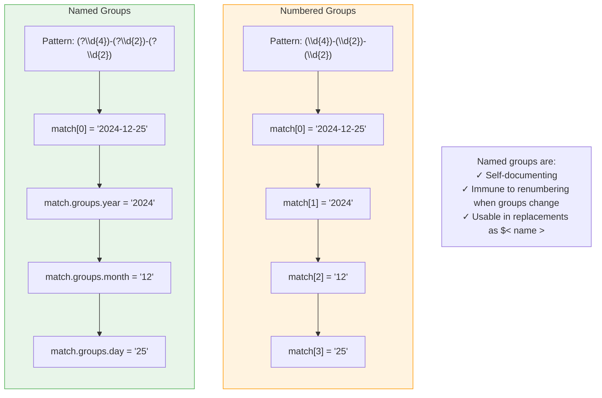
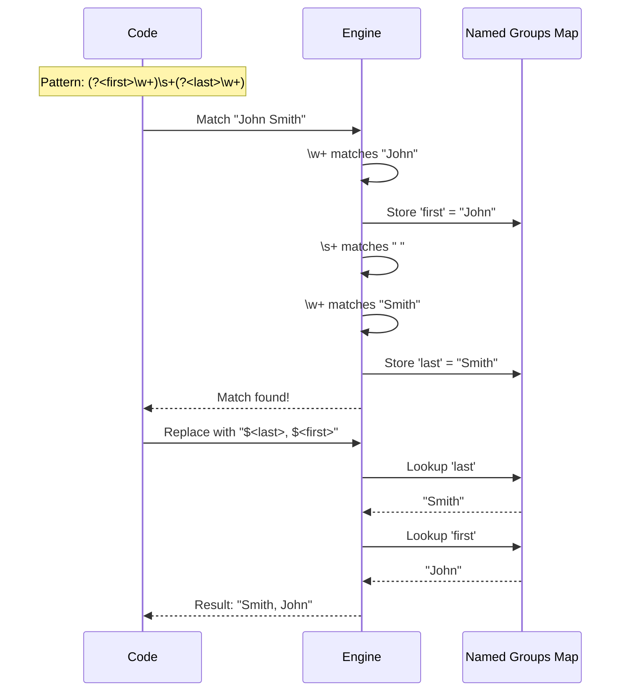
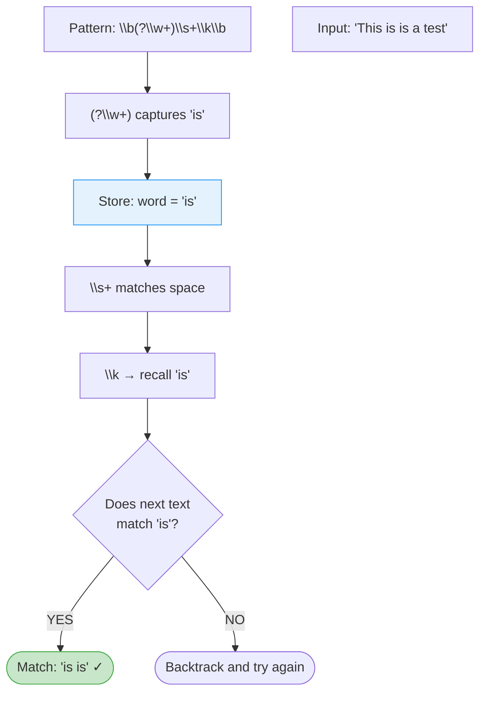
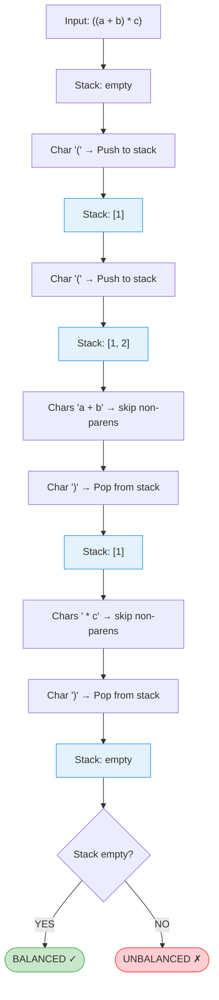
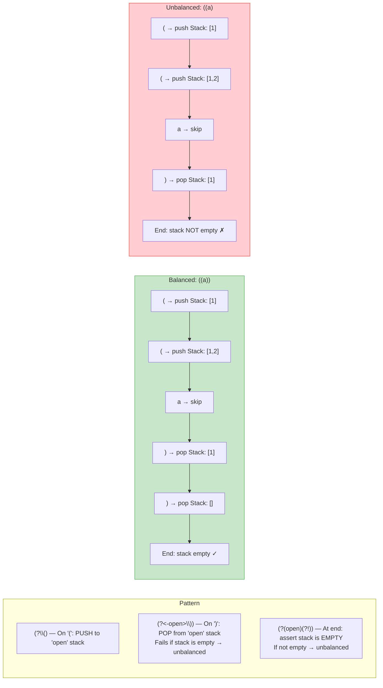
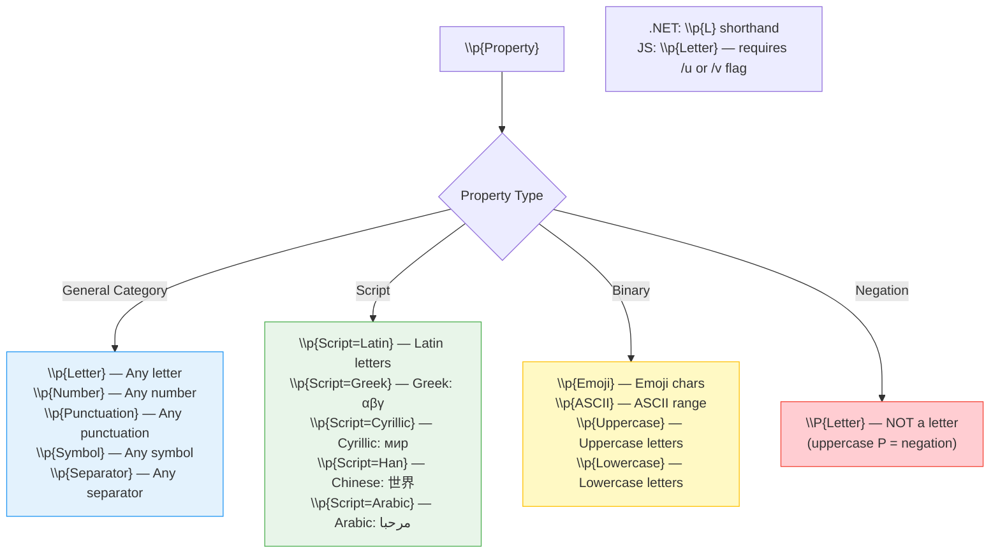
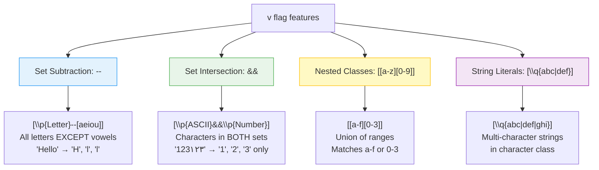
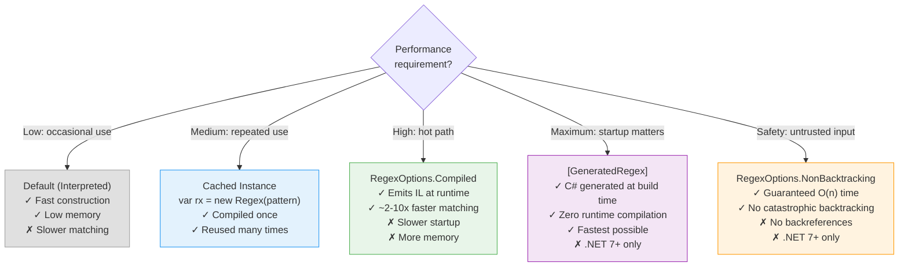
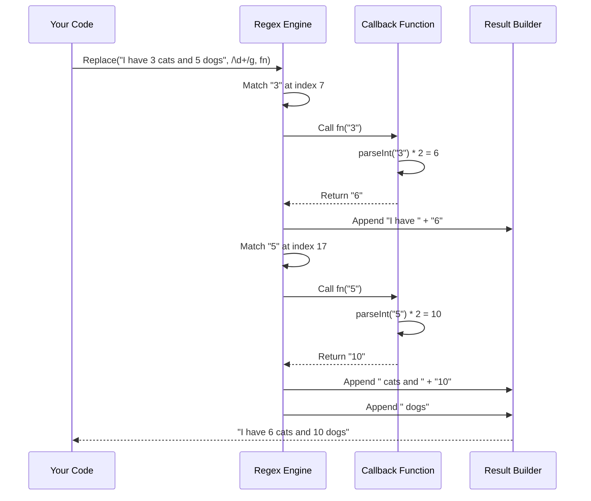
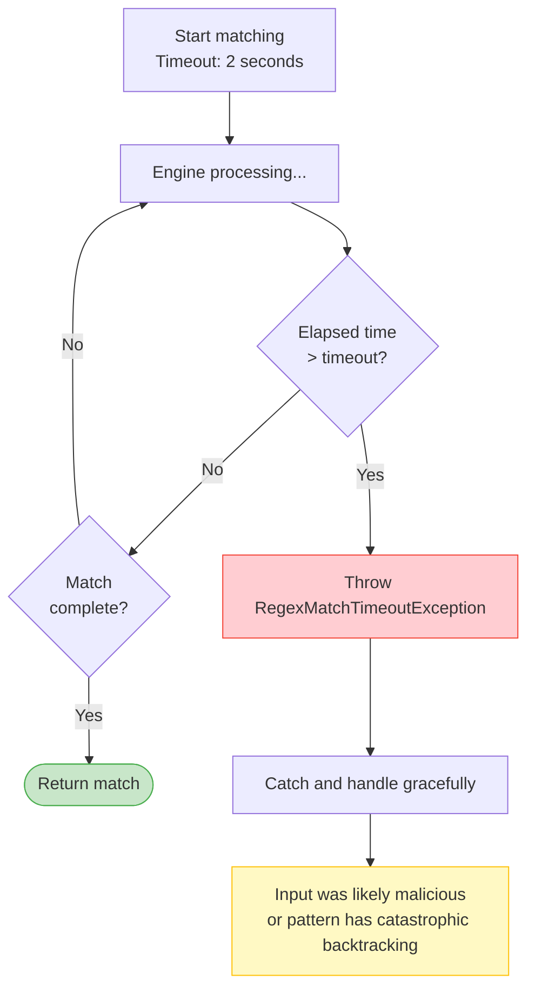

# Level 5: Advanced & Expert Features — Visual Diagrams

---

## Named Groups vs Numbered Groups

---

## Named Group Flow — Parse, Capture, Replace

---

## Named Backreference — \\k\<name\>

---

## Balancing Groups (.NET Only) — Matching Nested Structures

### Balancing Group Syntax Breakdown

---

## Unicode Property Escapes

---

## The /v Flag (ES2024) — Unicode Set Operations

---

## .NET Regex Compilation Modes

---

## MatchEvaluator / Function Callback Flow

---

## Regex Timeout (.NET) — Safety Net

