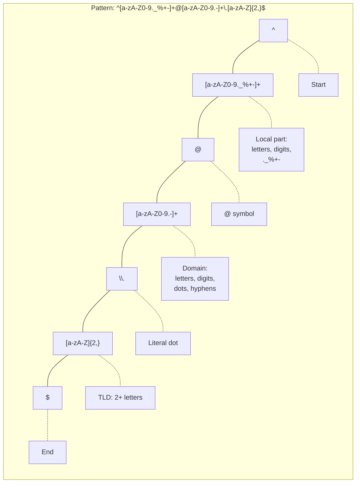
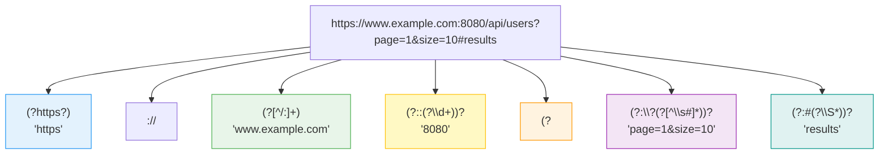
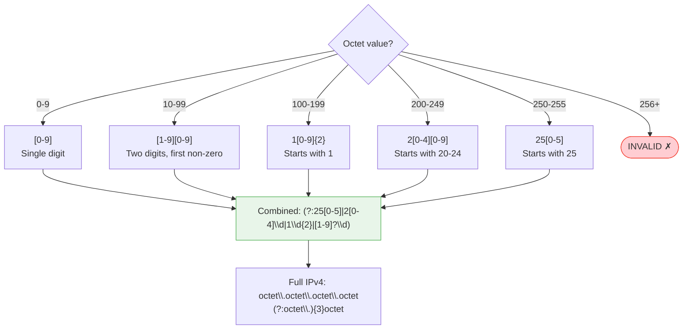
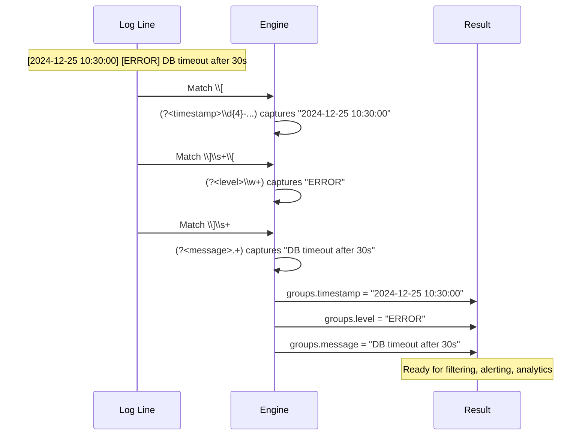
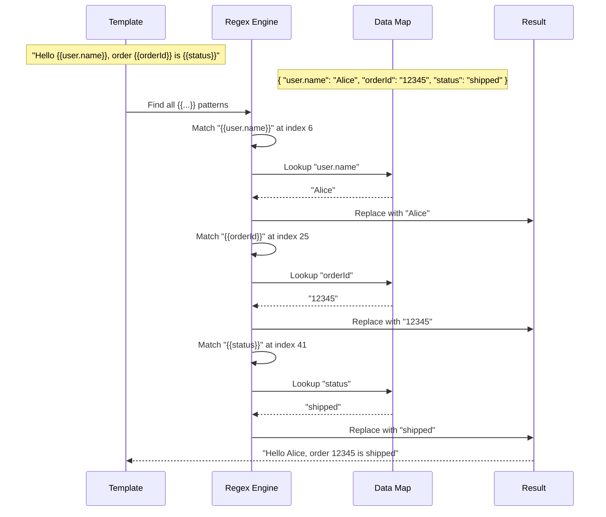
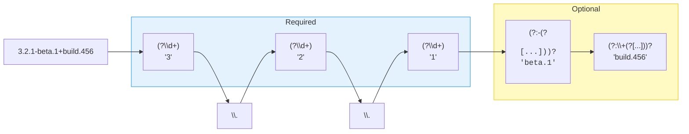
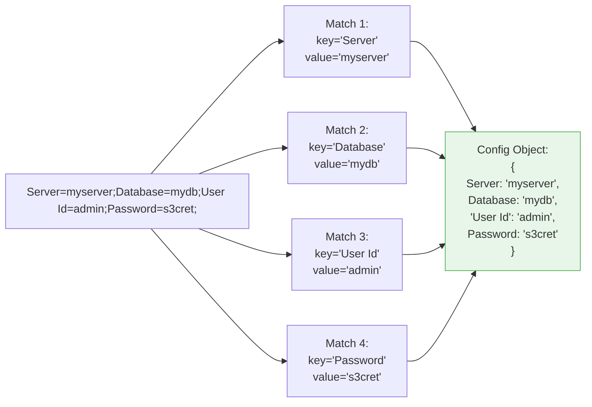
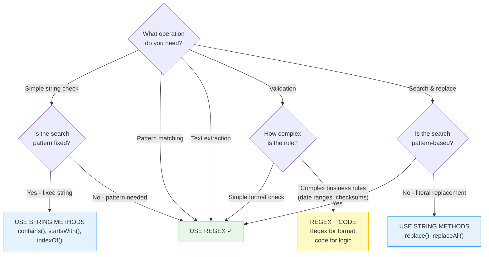

# Level 6: Real-World Use Cases — Visual Diagrams

---

## Email Validation Flow

```mermaid
flowchart TD
    Input["Input email"] --> Local{Valid local part?<br/>[a-zA-Z0-9._%+-]+}

    Local -->|"✓ 'user.name+tag'"| At{Has @ symbol?}
    Local -->|"✗ empty or invalid chars"| Fail([INVALID])

    At -->|"✓"| Domain{Valid domain?<br/>[a-zA-Z0-9.-]+}
    At -->|"✗"| Fail

    Domain -->|"✓ 'example.co'"| Dot{Has dot in domain?}
    Domain -->|"✗"| Fail

    Dot -->|"✓"| TLD{Valid TLD?<br/>[a-zA-Z]{2,}}
    Dot -->|"✗"| Fail

    TLD -->|"✓ 'com', 'uk'"| Pass([VALID ✓])
    TLD -->|"✗ too short"| Fail

    style Pass fill:#c8e6c9,stroke:#4CAF50
    style Fail fill:#ffcdd2,stroke:#f44336
```

### Email Pattern Breakdown



---

## URL Parsing — Component Extraction



---

## IP Address Validation — Octet Decision Tree



---

## Log File Parsing — Extraction Flow



---

## CSV Parsing — Handling Quoted Fields

```mermaid
flowchart TD
    Start["CSV Field"] --> Type{Starts with<br/>quote?}

    Type -->|"No"| Unquoted["Read until comma or end<br/>[^,\"]*<br/>Example: John"]
    Type -->|"Yes"| Quoted["Read between quotes<br/>Handle escaped quotes \"\"<br/>Example: \"Smith, Jr.\""]

    Quoted --> EscQ{Contains \"\"<br/>escaped quotes?}
    EscQ -->|"Yes"| Unescape["Replace \"\" with \"<br/>\"He said \"\"hello\"\"\"<br/>→ He said \"hello\""]
    EscQ -->|"No"| Done

    Unquoted --> Done["Field extracted"]
    Unescape --> Done

    style Unquoted fill:#e3f2fd,stroke:#2196F3
    style Quoted fill:#fff9c4,stroke:#FFC107
    style Unescape fill:#fff3e0,stroke:#FF9800
```

---

## Template Engine — Mustache-Style Parsing



---

## Semantic Version Parsing



---

## Connection String Parsing — Key-Value Extraction



---

## Use Case Decision Guide — When to Use Regex


