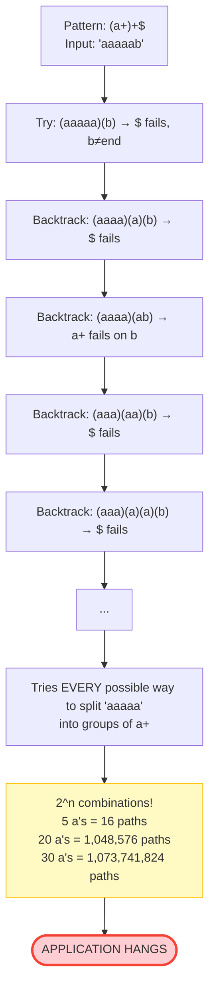
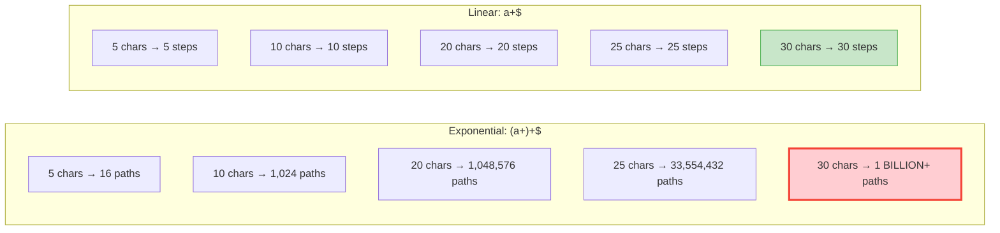
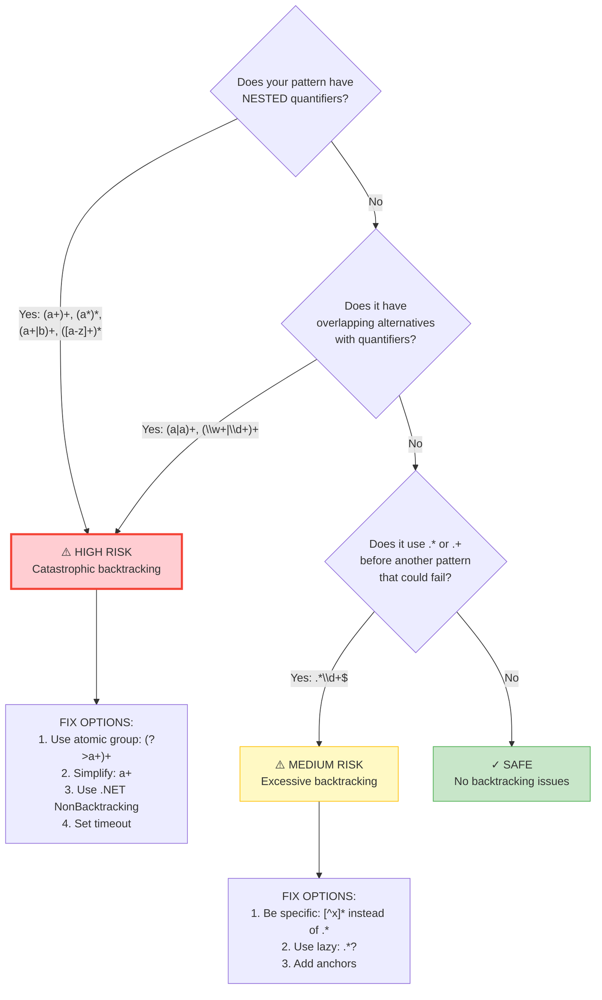
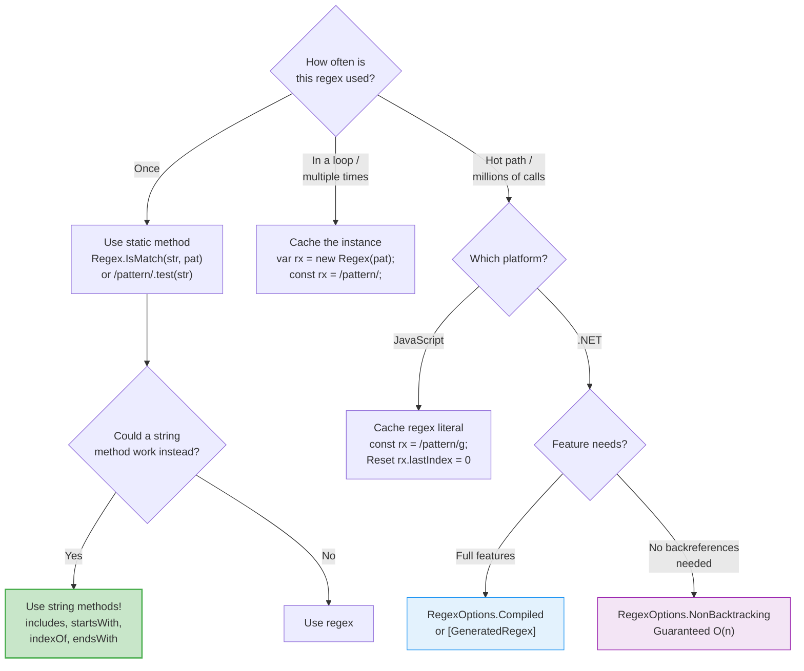
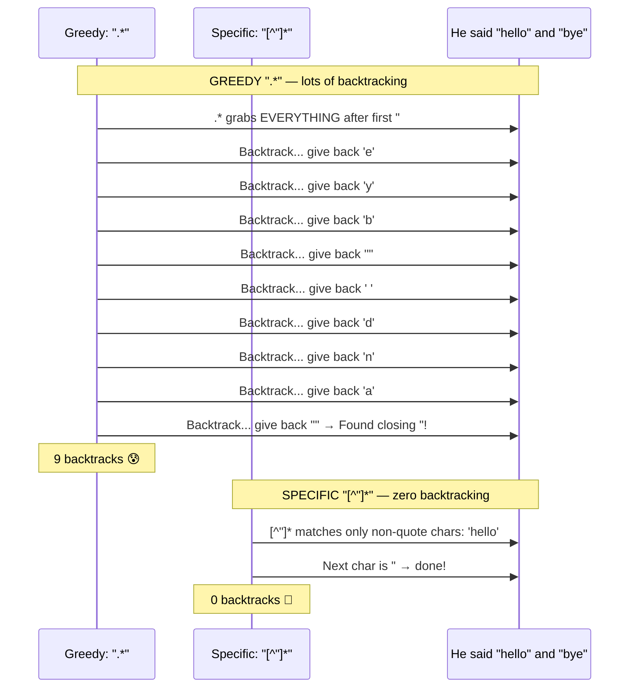
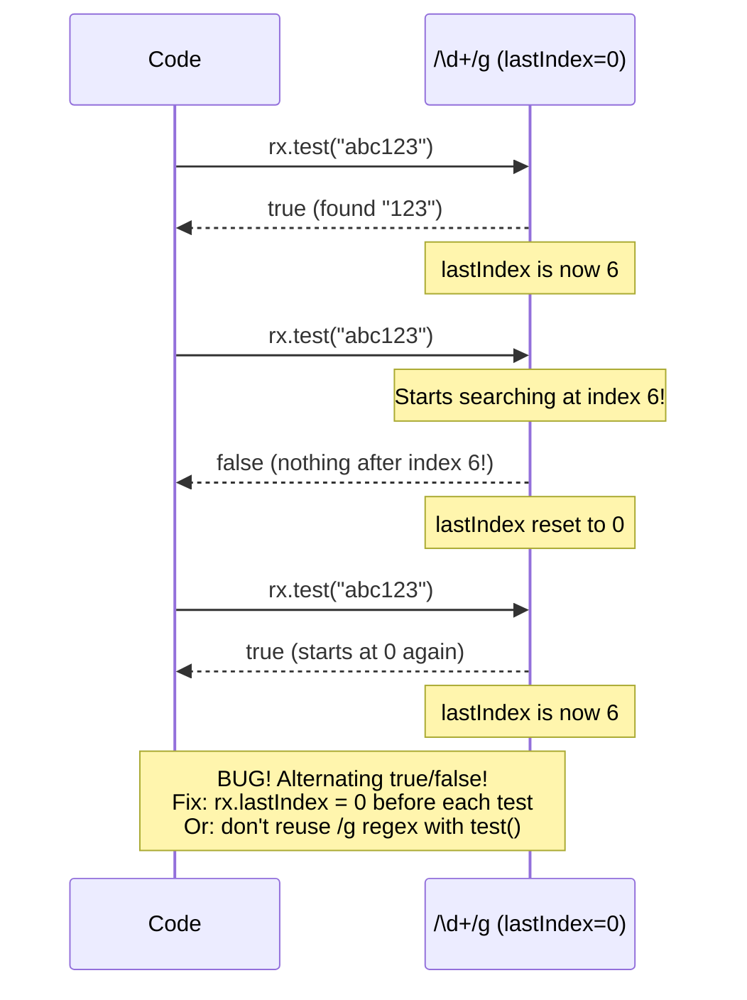

# Performance & Pitfalls — Visual Diagrams

---

## Catastrophic Backtracking — The #1 Performance Killer

Pattern `(a+)+$` against "aaaaaaaaaaab":

---

## Catastrophic Backtracking — Visualized

---

## Dangerous Pattern Detection — Decision Tree

---

## Performance Optimization Decision Flow

---

## Greedy .* vs Specific [^x]* — Performance Comparison

---

## The /g Flag Statefulness Pitfall (JavaScript)

---

## Common Pitfalls — Quick Reference

```mermaid
flowchart TD
    subgraph P1 ["Pitfall 1: Greedy by default"]
        direction LR
        Bad1["❌ <.*><br/>Matches too much"] --> Fix1["✅ <[^>]*><br/>or <.*?>"]
    end

    subgraph P2 ["Pitfall 2: Forgetting /g flag (JS)"]
        direction LR
        Bad2["❌ 'aaa'.replace(/a/, 'b')<br/>Result: 'baa'"] --> Fix2["✅ 'aaa'.replace(/a/g, 'b')<br/>Result: 'bbb'"]
    end

    subgraph P3 ["Pitfall 3: Not escaping user input"]
        direction LR
        Bad3["❌ new RegExp(userInput)<br/>Breaks if input has . * +"] --> Fix3["✅ new RegExp(escapeRegex(userInput))"]
    end

    subgraph P4 ["Pitfall 4: Nested quantifiers"]
        direction LR
        Bad4["❌ (a+)+<br/>Catastrophic backtracking"] --> Fix4["✅ a+<br/>Simplify!"]
    end

    subgraph P5 ["Pitfall 5: Using regex for simple tasks"]
        direction LR
        Bad5["❌ /^http/.test(url)<br/>Slower, harder to read"] --> Fix5["✅ url.startsWith('http')<br/>Faster, clearer"]
    end

    subgraph P6 ["Pitfall 6: No timeout on untrusted input"]
        direction LR
        Bad6["❌ new Regex(pattern)<br/>Can hang forever"] --> Fix6["✅ new Regex(pattern, opts,<br/>TimeSpan.FromSeconds(2))"]
    end

    style Bad1 fill:#ffcdd2,stroke:#f44336
    style Bad2 fill:#ffcdd2,stroke:#f44336
    style Bad3 fill:#ffcdd2,stroke:#f44336
    style Bad4 fill:#ffcdd2,stroke:#f44336
    style Bad5 fill:#ffcdd2,stroke:#f44336
    style Bad6 fill:#ffcdd2,stroke:#f44336
    style Fix1 fill:#c8e6c9,stroke:#4CAF50
    style Fix2 fill:#c8e6c9,stroke:#4CAF50
    style Fix3 fill:#c8e6c9,stroke:#4CAF50
    style Fix4 fill:#c8e6c9,stroke:#4CAF50
    style Fix5 fill:#c8e6c9,stroke:#4CAF50
    style Fix6 fill:#c8e6c9,stroke:#4CAF50
```

---

## Performance Tier Chart

```mermaid
flowchart LR
    subgraph Fastest ["🥇 Fastest"]
        direction TB
        F1["String methods<br/>includes, startsWith, indexOf"]
        F2["[GeneratedRegex] (.NET 7+)<br/>Compiled at build time"]
    end

    subgraph Fast ["🥈 Fast"]
        direction TB
        F3["Cached regex literal<br/>const rx = /pattern/"]
        F4["RegexOptions.Compiled (.NET)<br/>IL emitted at runtime"]
    end

    subgraph Medium ["🥉 Medium"]
        direction TB
        F5["Cached new Regex(pattern)<br/>Interpreted mode"]
    end

    subgraph Slow ["🐌 Slow"]
        direction TB
        F6["Static Regex.IsMatch()<br/>Checks cache, may recompile"]
        F7["new RegExp() in loop<br/>Recompiled every iteration"]
    end

    Fastest --> Fast --> Medium --> Slow

    style Fastest fill:#c8e6c9,stroke:#4CAF50
    style Fast fill:#e3f2fd,stroke:#2196F3
    style Medium fill:#fff9c4,stroke:#FFC107
    style Slow fill:#ffcdd2,stroke:#f44336
```

