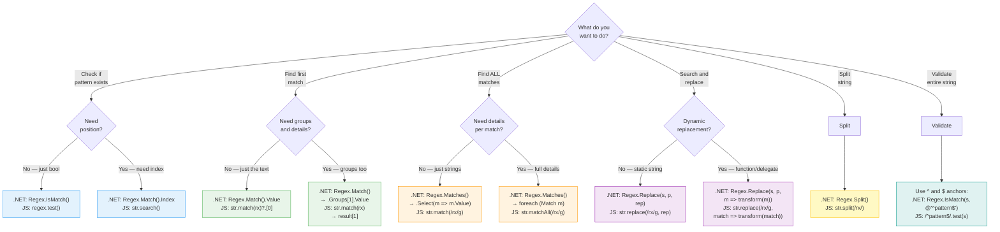
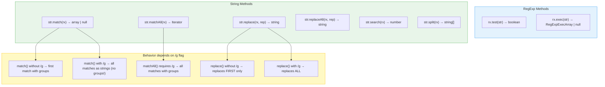
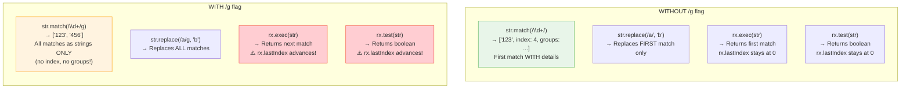
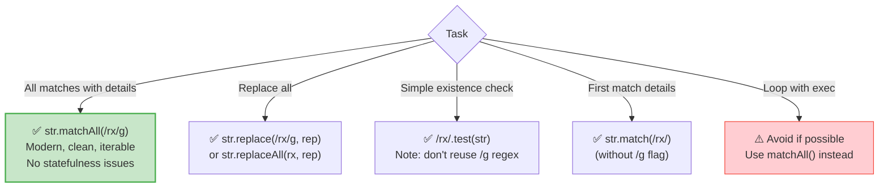

# Method Selection Guide — .NET vs TypeScript

---

## Complete Decision Flowchart — Which Method to Use

---

## .NET Methods — Complete Mapping

```mermaid
flowchart TD
    subgraph Static ["Static Methods (one-off use)"]
        direction TB
        S1["Regex.IsMatch(input, pattern)"]
        S2["Regex.Match(input, pattern)"]
        S3["Regex.Matches(input, pattern)"]
        S4["Regex.Replace(input, pattern, rep)"]
        S5["Regex.Split(input, pattern)"]
    end

    subgraph Instance ["Instance Methods (repeated use)"]
        direction TB
        I1["var rx = new Regex(pattern);"]
        I2["rx.IsMatch(input)"]
        I3["rx.Match(input)"]
        I4["rx.Matches(input)"]
        I5["rx.Replace(input, rep)"]
        I6["rx.Split(input)"]
    end

    subgraph Results ["Return Types"]
        direction TB
        R1["bool"]
        R2["Match<br/>.Value .Index .Groups"]
        R3["MatchCollection<br/>IEnumerable of Match"]
        R4["string (replaced)"]
        R5["string[] (parts)"]
    end

    S1 & I2 --> R1
    S2 & I3 --> R2
    S3 & I4 --> R3
    S4 & I5 --> R4
    S5 & I6 --> R5

    style Static fill:#e3f2fd,stroke:#2196F3
    style Instance fill:#e8f5e9,stroke:#4CAF50
```

---

## TypeScript/JavaScript Methods — Complete Mapping

---

## The /g Flag Impact — JavaScript Behavior Matrix

---

## Preferred Modern Approach — JavaScript

---

## Feature Comparison — .NET vs TypeScript

```mermaid
flowchart TB
    subgraph Both ["Both .NET and TypeScript"]
        direction TB
        B1["Capturing groups (...)"]
        B2["Non-capturing groups (?:...)"]
        B3["Named groups (?<name>...)"]
        B4["Lookahead (?=) (?!)"]
        B5["Lookbehind (?<=) (?<!)"]
        B6["Backreferences \\1, \\k<name>"]
        B7["Character classes [a-z]"]
        B8["All quantifiers * + ? {n,m}"]
        B9["Greedy and lazy modes"]
    end

    subgraph DotNetOnly [".NET Only"]
        direction TB
        D1["Balancing groups (?<name>-<other>)"]
        D2["RegexOptions.Compiled"]
        D3["[GeneratedRegex] source gen"]
        D4["Regex timeout (TimeSpan)"]
        D5["NonBacktracking engine"]
        D6["(?x) verbose/commented mode"]
        D7["Conditional: (?(cond)yes|no)"]
        D8["Atomic groups (?>...)"]
    end

    subgraph JSOnly ["TypeScript/JS Only"]
        direction TB
        J1["/y sticky flag"]
        J2["/s dotAll flag"]
        J3["/d hasIndices flag"]
        J4["/v unicodeSets flag"]
        J5["Set operations (&&, --)"]
        J6["Symbol.match customization"]
        J7["String.raw for patterns"]
        J8["matchAll() iterator"]
    end

    style Both fill:#e8f5e9,stroke:#4CAF50
    style DotNetOnly fill:#e3f2fd,stroke:#2196F3
    style JSOnly fill:#fff3e0,stroke:#FF9800
```

