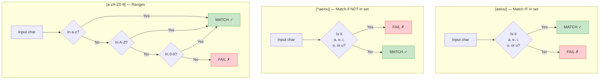
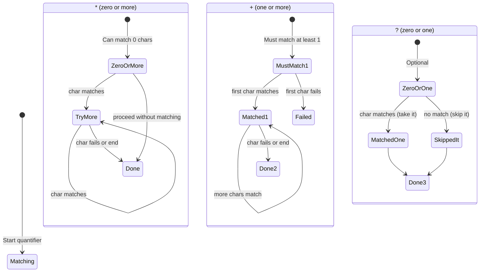
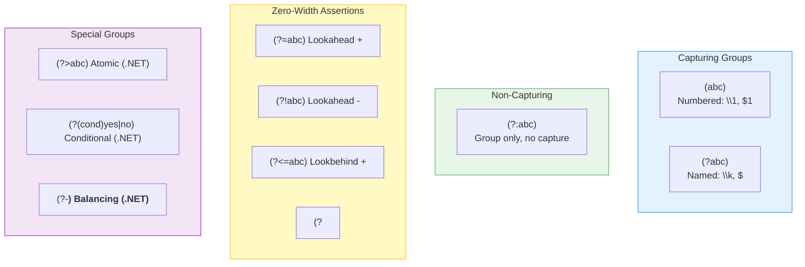
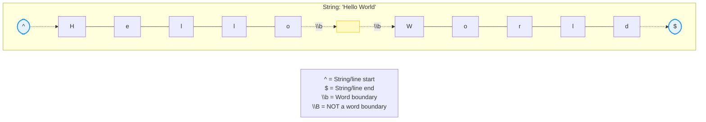
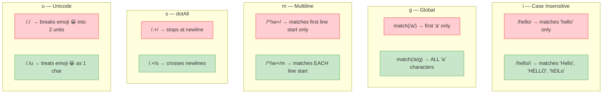
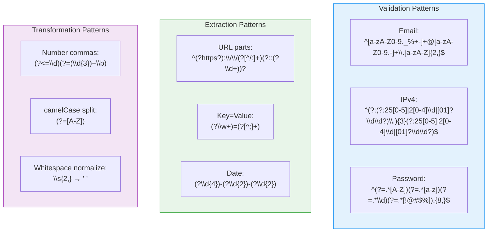

# Visual Cheat Sheet — Complete Regex Syntax

---

## Master Overview — All Regex Components

```mermaid
flowchart TD
    Regex["Regular Expression<br/>Components"]

    Regex --> Chars["Characters"]
    Regex --> Quant["Quantifiers"]
    Regex --> Groups["Groups"]
    Regex --> Anchors["Anchors"]
    Regex --> Look["Lookarounds"]
    Regex --> Flags["Flags/Options"]

    Chars --> Literal["Literal: abc"]
    Chars --> Dot[". any char"]
    Chars --> Class["[abc] class"]
    Chars --> Short["\\d \\w \\s shorthand"]
    Chars --> Unicode["\\p{Letter} unicode"]

    Quant --> Star["* zero+"]
    Quant --> Plus["+ one+"]
    Quant --> Opt["? optional"]
    Quant --> Exact["{n} exact"]
    Quant --> Range["{n,m} range"]
    Quant --> Lazy["? lazy modifier"]

    Groups --> Cap["(...) capture"]
    Groups --> NonCap["(?:...) non-capture"]
    Groups --> Named["(?<n>...) named"]
    Groups --> Alt["a|b alternation"]
    Groups --> BackRef["\\1 backreference"]

    Anchors --> Start["^ start"]
    Anchors --> End["$ end"]
    Anchors --> Word["\\b word boundary"]

    Look --> PLA["(?=) positive ahead"]
    Look --> NLA["(?!) negative ahead"]
    Look --> PLB["(?<=) positive behind"]
    Look --> NLB["(?<!) negative behind"]

    Flags --> FG["g global"]
    Flags --> FI["i case-insensitive"]
    Flags --> FM["m multiline"]
    Flags --> FS["s dotAll"]
    Flags --> FU["u unicode"]

    style Regex fill:#f3e5f5,stroke:#9C27B0,stroke-width:2px
    style Chars fill:#e3f2fd,stroke:#2196F3
    style Quant fill:#e8f5e9,stroke:#4CAF50
    style Groups fill:#fff3e0,stroke:#FF9800
    style Anchors fill:#fff9c4,stroke:#FFC107
    style Look fill:#e0f2f1,stroke:#009688
    style Flags fill:#fce4ec,stroke:#E91E63
```

---

## Pattern Reading Guide — Left to Right

```mermaid
flowchart LR
    subgraph "Pattern: ^(?<year>\\d{4})-(?<month>0[1-9]|1[0-2])-(?<day>\\d{2})$"
        direction LR
        A["^<br/>Start"] --> B["(?<year><br/>Named group"]
        B --> C["\\d{4}<br/>4 digits"]
        C --> D[")<br/>End group"]
        D --> E["-<br/>Literal dash"]
        E --> F["(?<month><br/>Named group"]
        F --> G["0[1-9]<br/>01-09"]
        G --> H["|<br/>OR"]
        H --> I["1[0-2]<br/>10-12"]
        I --> J[")<br/>End group"]
        J --> K["-<br/>Literal dash"]
        K --> L["(?<day><br/>Named group"]
        L --> M["\\d{2}<br/>2 digits"]
        M --> N[")<br/>End group"]
        N --> O["$<br/>End"]
    end
```

---

## Character Class Internals

---

## Quantifier Behavior — State Machine View

---

## Group Types — Complete Reference

---

## Anchor Positions — Visual Map

---

## Flag Effects — Before and After

---

## Common Pattern Templates

